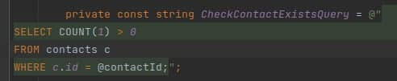

# Оптимизации

> Раздел в разработке [19.07.2021]

В этой статье собраны правила, который помогут оптимизировать работу с БД.

## Проверка наличия элементов в БД

Когда нам надо проверить голым SQL, есть ли в базе какая-то сущность, то лучше использовать не `COUNT(1)`, а `SELECT EXISTS`. 



Например, тут лучше сделать так:
```
select exists(SELECT 1
FROM contacts c
WHERE ...
```

`Count` для своей работы нужно пройтись `ПО ВСЕЙ таблице`, `EXISTS` же достаточно одного элемента, чтобы вернуть `true`. Т.е. в худшем случае он будет работать также, как `count`, а в среднем быстрее.