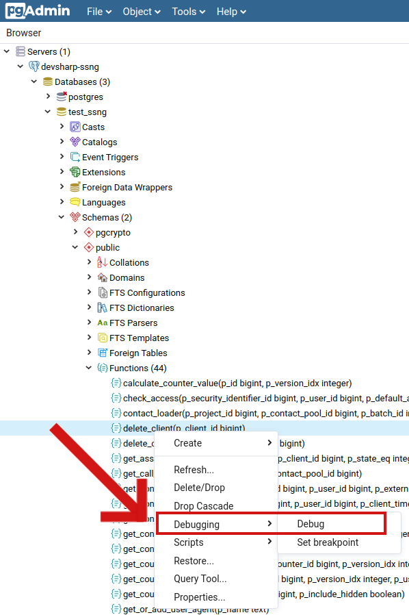

# Postgres

## Отладчик

Если требуется отладка хранимых процедур, то возможно задействовать plugin отладчика для PostgreSQL и pgAdmin. В этой статье можно найти соответствующие инструкции по установке, инициализации и использованию отладчика. Всё описанное ниже справедливо для Debian 10.1 и PostgreSQL 11.5.

### Установка

Для начала потребуется установка зависимостей, необходимых для сборки отладчика:

```Bash
sudo apt install postgresql-server-dev-11
sudo apt install libkrb5-dev
```

Клонируем репозиторий и собираем plugin:

```Bash
git clone git://git.postgresql.org/git/pldebugger.git
cd pldebugger
export USE_PGXS=1
make
```

Далее нужно скопировать собранный plugin в соответствующие целевой инталляции postgres директории:

```Bash
sudo cp ./plugin_debugger.so /usr/lib/postgresql/11/lib/
sudo cp ./pldbgapi.control /usr/share/postgresql/11/extension/
sudo cp ./pldbgapi--* /usr/share/postgresql/11/extension/
```

Чтобы PostgreSQL подключила и смогла использовать plugin отладчика - требуется сначала отредактировать файл настроек postgresql.conf. Скорее всего он будет расположен в ```/etc/postgresql/11/main/postgresql.conf```.
В конфиге нужно раскомментировать и изменить или добавить следующую строку: 

```Bash
shared_preload_libraries = 'plugin_debugger'
```

После этого протребуется перезапустить PostgreSQL:
```Bash
sudo systemctl restart postgresql
```

На этом установка завершена. 

### Инициализация

Для использования плагина - нужно инициализировать его в каждой базе, в которой он требуется. Для этого надо выполнить следующий скрипт.

```SQL
CREATE EXTENSION pldbgapi;
```

### Использование

Использовать данный отладчик можно только вместе с pgAdmin 4. Достаточно локально установленной версии. Инструкции по установке на разные операционные системы доступны на [официальном сайте](https://www.pgadmin.org/download/).

После установки и подключения к базе достаточно выбрать требующую отладку функцию и выбрать во всплывающем окне опцию Debug:
.