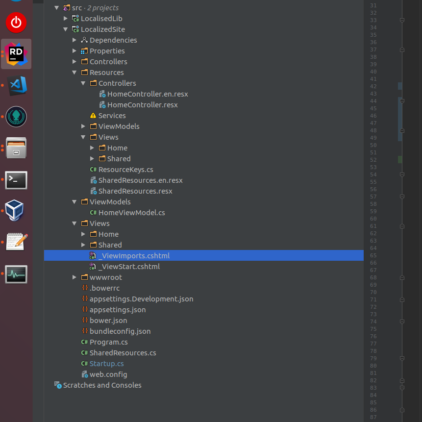

# Локализация

> Раздел в разработке [15.02.2021]

Для локализации `.net core` приложений пользуемся встроенными инструментами фреймворка. Через `IoC` контейнер для локализации можно получить реализации следующих интерфейсов:

- `IStringLocalizer<>`: для получения локализованной строки для конкретного класса
- `IHtmlLocalizer<>`: для получения локализованной строки для конкретного класса, игнорируются html теги
- `IViewLocalizer`: для локализации представлений

`Microsoft` предлагает в качестве ключа для поиска локализованной строки использовать саму строку на английском языке. Этот подход считаем для себя неприменимым, т.к.:

- при изменении самой строки нужно обновить везде ресурсы
- в коде будут магические текстовые строки

Поэтому отдельно в каталоге `Resources` создается статический класс `ResourceKeys`, в котором содержатся ключи локализуемых строк:

```csharp
/// <summary>
/// Класс с ключами ресурсов.
/// </summary>
/// <remarks>
/// Все ключи должны вноситься сюда
/// </remarks>
public static class ResourceKeys
{

    #region SharedResources

    public const string HomePage_Title = "HomeTitle";

    public const string AboutView_Title= "AboutTitle";

    public const string ContactView_Title= "ContactTitle";

    #endregion

    public const string Required = "Required";

    public const string NotAValidEmail = "NotAValidEmail";

    public const string YourEmail = "YourEmail";

    #region HomeController

    public const string HomeController_SuccessMessage = "Success";

    public const string HomeController_AboutContent = "About";

    public const string HomeController_ContactContent = "Contact";

    #endregion
}
```

Т.к. файл общий и строк будет много, то нужно использовать регионы (`#region`) для группировки их по тем классам, где используется локализуемая строка.

Локализация включается в методе `ConfigureServices` класса `Startup` или ручным добавлением к `IoC` следующим образом:

```csharp
// подключаем локализацию
services.AddLocalization(
    opts =>
{
    // указываем путь к ресурсам
    opts.ResourcesPath = "Resources";
});

services.AddMvc()
    // подкючаем локализацию MVC
    .AddViewLocalization(
        // выбираем тип поиска ресурсов
        LanguageViewLocationExpanderFormat.SubFolder,
        opts =>
        {
            // указываем путь к ресурсам
            opts.ResourcesPath = "Resources";
        })
    // подкючаем локализацию аннотаций для MVC
    .AddDataAnnotationsLocalization();

// настраиваем поддерживаемые локали и локаль по умолчанию
services.Configure<RequestLocalizationOptions>(
    opts =>
    {
        var supportedCultures = new List<CultureInfo>
        {
            new CultureInfo("en"),
            new CultureInfo("ru-RU"),
            new CultureInfo("ru")
        };

        // культура по умолчанию для запросов
        opts.DefaultRequestCulture = new RequestCulture("ru");
        // список доступных культур
        opts.SupportedCultures = supportedCultures;
        opts.SupportedUICultures = supportedCultures;
    });

services.AddSingleton<ILocalisedService, LocalizedService>();
```

В ASP.Net Core можно выбрать несколько способов получения локали пользователя: по строке запроса, на основе Cookies и на основе содержимого заголовка запроса. Все задается в методе `ConfigureServices` класса `Startup`:

```csharp
 app.UseRequestLocalization(app.ApplicationServices.GetService<IOptions<RequestLocalizationOptions>>().Value);

```

По умолчанию, используются все три способа в следующем порядке:

- строка запроса
- Cookies
- заголовки

Можно добавить свое правило. Подробности в полезных ссылках ниже.

## Организация пространства ресурсов

Все ресурсы должны располагаться в директории `Resources`. Поиск файла с ресурсами может работать по двум стратегиям:

- `поиск по директориям`: в директории `Resources` должна быть воссоздана точная иерархия пространств имен проекта, сам ресурс должен называться также, как и класс, для которого этот ресурс предназначен
- `поиск по имени`: директории не нужны, требуется, чтобы полное имя ресурса совпадало с именем класса, для которого этот ресурс предназначен.

Мы выбираем первый поход, `поиск по директориям`, т.к. поиск ресурсов будет более интуитивно-понятным и не будет "свалки" из ресурсов.



## Локаль по умолчанию

Локалью по умолчанию считаем русскую (`ru`). Для файла с ресурсами этой локали никаких суффиксов указывать не надо. Для остальных обязательно указывает локаль. Примеры:

```bash
HomeController.resx
HomeController.en.resx
```

## Общие ресурсы

Чтобы не дублировать сообщения, которые встречаются часто, их можно вынести в общие ресурсы. Для этого в директории `Resources` необходимо создать ресурсы с названием `SharedResources[.local].resx`. В корне проекта добавить статический пустой класс `SharedResources`:

```csharp
/// <summary>
/// Класс для обращения к общим ресурсам
/// </summary>
/// <remarks>
/// Должен быть пустым и находиться в корне проекта
/// </remarks>
public class SharedResources
{
}
```

Чтобы пользоваться общими ресурсами, надо получить реализацию `IStringLocalizer<SharedResources>`.

## Подводные камни

### Internal visibility

Чтобы ключи ресурсов и сами ресурсов не были доступны извне сборки, их стоит помечать атрибутом `internal`. Однако в таком случаем не будет работать представления, т.к.в  ходе компиляции они будут помещены в другую сборку, и ресурсы станут недоступными. В качестве решения можно вынести `View` в отдельную сборку, подробнее на [StackOverflow](https://stackoverflow.com/questions/25520672/use-an-internal-class-in-razor-view).

## Пример

Пример локализованного ASP.Net приложения доступен в [примерах](https://github.com/MarvinBand/Guidelines/tree/develop/samples) этого репозитория

## Полезные ссылки

- [Документация Microsoft](https://docs.microsoft.com/en-us/aspnet/core/fundamentals/localization?view=aspnetcore-2.1)
- [Подробный пример добавления локализации без аннотаций](https://andrewlock.net/adding-localisation-to-an-asp-net-core-application/)
- [Пример локализованного ASP.Net Core MVC приложения](https://github.com/aspnet/Entropy/tree/master/samples/Localization.StarterWeb)