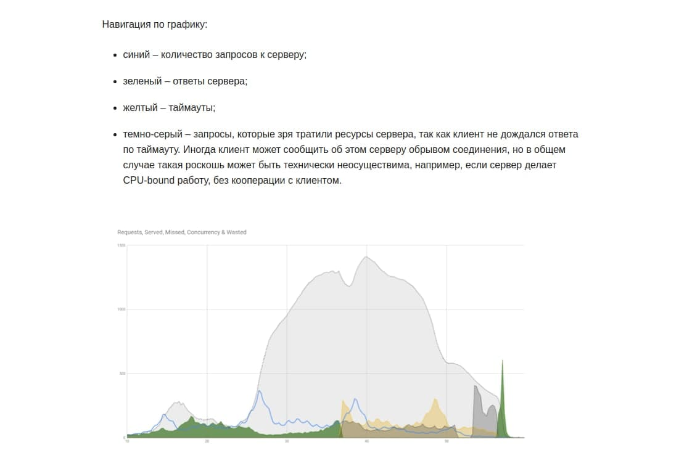

# Оптимизации в Web приложениях

> Раздел в разработке [19.07.2021]

## ASP.NET Core

### Передавать в action'ы контролера `CancellationToken`

Пользователь может обновить страницу, соединение может оборваться. Тогда пользователь не получит результат выполнения метода из нашего приложения. Но метод будет продолжать работать, не принося никому пользу, а только нагружая приложение (серый цвет на графике).

Но если просто добавить в каждый `action` обычный аргумент `CancellationToken ct`, то это снизит нагрузку. 
Когда запрос прервется, будет вызван метод Cancel у этого токена. Это снимает нагрузку от запросов, которые пользователь отменил. (т.е. может сбривать серую часть графика).

Пруф: https://habr.com/en/company/dododev/blog/461081/